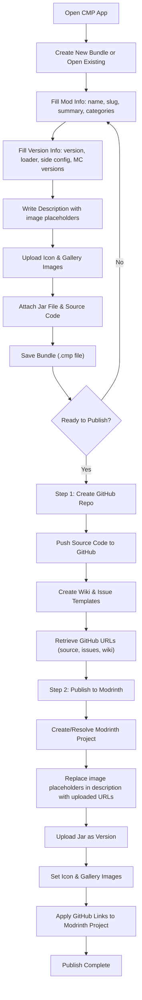

## 1. Product Overview

CMP (Center Mod Publishment) is a macOS Apple Silicon desktop application that provides a unified, single-file workflow for packaging and publishing Minecraft mods to Modrinth and GitHub. It replaces the fragmented multi-script pipeline with a visual editor that produces one `.cmp` bundle (a zip containing a `manifest.json` + all referenced assets), then orchestrates GitHub project creation and Modrinth publishing in a single click.

- **Problem**: The current ModCompiler workflow requires users to manually organize jars, source code, metadata, and images across multiple directories and scripts, with no visual feedback and no single source of truth for a mod's publishable state.
- **Target users**: Minecraft mod developers who want to publish to Modrinth with an associated GitHub repository.
- **Value**: One file, one app, one click to go from built mod to fully published project on both GitHub and Modrinth.

## 2. Core Features

### 2.1 User Roles

| Role | Description |
|------|-------------|
| Mod Author | Creates, edits, and publishes mod bundles through the CMP app |

### 2.2 Feature Modules

1. **Bundle Editor**: Visual form-based editor for creating and editing `.cmp` bundles (manifest.json + assets)
2. **Publish Dashboard**: One-click publishing workflow — creates GitHub repo, then publishes to Modrinth
3. **Bundle Manager**: List, open, and manage saved `.cmp` bundles

### 2.3 Page Details

| Page Name | Module Name | Feature Description |
|-----------|-------------|---------------------|
| Bundle Editor | Mod Info Form | Name, slug, summary, categories, license fields |
| Bundle Editor | Version Info Form | Mod version, loader (fabric/forge/neoforge), client/server side config, Minecraft versions |
| Bundle Editor | Description Editor | Rich text/markdown editor with image placeholder insertion; images referenced by index, replaced on upload |
| Bundle Editor | Icon & Gallery | Drag-drop icon upload, gallery image management with title/description/featured flags |
| Bundle Editor | File Attachments | Drag-drop jar file and source code folder selection |
| Bundle Editor | Link Configuration | GitHub owner, repo name; Modrinth project ID; auto-populated after GitHub creation |
| Bundle Editor | Bundle Preview | Live preview of the complete manifest.json; export/save/open bundle |
| Publish Dashboard | GitHub Creation | Create public repo with source, README, wiki, issue templates; retrieve URLs |
| Publish Dashboard | Modrinth Publishing | Upload jar as version, set icon/gallery, apply GitHub links; status tracking |
| Publish Dashboard | Publish Log | Real-time log of publish operations with success/failure per step |
| Bundle Manager | Bundle List | List all saved bundles with name, status, last modified |
| Bundle Manager | Quick Actions | Open in editor, duplicate, delete, publish |

## 3. Core Process

The user creates a `.cmp` bundle file that serves as the single source of truth for a mod's publishable state. This bundle contains a `manifest.json` and all referenced binary assets (jar, icon, gallery images, source code). The publishing flow first creates a GitHub repository (pushing source, wiki, issues), retrieves the generated URLs, injects them into the Modrinth payload, then publishes to Modrinth.



## 4. User Interface Design

### 4.1 Design Style

- **Primary color**: Deep charcoal (#1A1A2E) with electric teal accents (#00D4AA)
- **Secondary color**: Warm slate (#16213E) for cards and panels
- **Accent**: Bright teal (#00D4AA) for CTAs and active states, coral (#E94560) for errors/warnings
- **Button style**: Rounded (8px radius), solid fill with subtle shadow; primary buttons in teal, secondary in slate
- **Font**: JetBrains Mono for code/technical labels, Plus Jakarta Sans for body text and headings
- **Layout style**: Sidebar navigation + main content area; card-based sections within the editor
- **Icon style**: Lucide icons (line-style, consistent stroke width)
- **Overall aesthetic**: Developer-tool meets dark-mode editor — clean, dense, functional, with subtle glow effects on interactive elements

### 4.2 Page Design Overview

| Page Name | Module Name | UI Elements |
|-----------|-------------|-------------|
| Bundle Editor | Mod Info Form | Text inputs for name/slug (auto-generates slug from name), multi-select for categories, dropdown for license |
| Bundle Editor | Version Info Form | Semantic version input, loader radio buttons (Fabric/Forge/NeoForge), side-config dropdowns (Required/Optional/Unsupported), tag input for MC versions |
| Bundle Editor | Description Editor | Split-pane markdown editor (left: edit, right: preview); toolbar with image-insert button that adds `{{image:N}}` placeholders |
| Bundle Editor | Icon & Gallery | Icon: square drop zone with preview; Gallery: grid of thumbnail cards with edit/delete, drag-reorder |
| Bundle Editor | File Attachments | Two drop zones: one for .jar (validates it's a jar), one for source folder (shows file count) |
| Bundle Editor | Link Configuration | Text inputs for GitHub owner/repo, Modrinth project ID; "Auto-fill from GitHub" button after repo creation |
| Bundle Editor | Bundle Preview | Syntax-highlighted JSON preview in a code block; "Export .cmp" and "Save" buttons |
| Publish Dashboard | GitHub Creation | Card showing repo creation status with progress steps; "Create Repository" button |
| Publish Dashboard | Modrinth Publishing | Card showing publish status with per-step indicators; "Publish to Modrinth" button |
| Publish Dashboard | Publish Log | Scrollable terminal-style log with colored output (green=success, red=error, yellow=warning) |
| Bundle Manager | Bundle List | Grid of bundle cards showing icon, name, version, status badge, last modified date |
| Bundle Manager | Quick Actions | Context menu or action buttons on each card |

### 4.3 Responsiveness

- Desktop-first design (this is a macOS Electron app)
- Minimum window size: 1024x768
- Sidebar collapses to icons below 1200px width
- Editor sections stack vertically on narrow windows

### 4.4 The .cmp Bundle Format

A `.cmp` file is a standard `.zip` archive with this structure:

```
my-cool-mod.cmp
  manifest.json          # All metadata (see schema below)
  jar/                   # The mod jar file
    my-cool-mod-1.0.0.jar
  source/                # Source code (recursive)
    src/
      main/
        java/
          com/
            example/
              CoolMod.java
  icon.png               # Project icon
  gallery/
    0.png                # Gallery images indexed by number
    1.png
  description_images/
    0.png                # Images referenced in description body
    1.png
```

**manifest.json schema:**

```json
{
  "cmp_version": 1,
  "mod_info": {
    "name": "My Cool Mod",
    "slug": "my-cool-mod",
    "summary": "A brief one-line description",
    "categories": ["adventure", "utility"],
    "license": "MIT"
  },
  "version_info": {
    "mod_version": "1.0.0",
    "loader": "fabric",
    "client_side": "required",
    "server_side": "optional",
    "minecraft_versions": ["1.20.1", "1.20.4", "1.20.6"]
  },
  "description": {
    "body": "## Features\n\nThis mod adds {{image:0}} cool things.\n\n### Details\n\nMore info here {{image:1}}.",
    "images": [
      { "index": 0, "file": "description_images/0.png", "caption": "Feature showcase" },
      { "index": 1, "file": "description_images/1.png", "caption": "Config screen" }
    ]
  },
  "icon": "icon.png",
  "gallery": [
    { "index": 0, "file": "gallery/0.png", "featured": true, "title": "Main screenshot", "description": "Shows the main feature" },
    { "index": 1, "file": "gallery/1.png", "featured": false, "title": "Config screen", "description": "Configuration UI" }
  ],
  "files": {
    "jar": "jar/my-cool-mod-1.0.0.jar",
    "source": "source/"
  },
  "links": {
    "homepage": "",
    "sources": "",
    "issues": "",
    "wiki": ""
  },
  "publishing": {
    "modrinth_project_id": "",
    "github_owner": "",
    "github_repo_name": "",
    "version_type": "release"
  }
}
```

Key design decisions:
- `{{image:N}}` placeholders in description body are replaced with actual Modrinth-hosted image URLs after upload
- `links` fields are auto-populated after GitHub repo creation
- `publishing.modrinth_project_id` can be empty for new projects (CMP will create a draft) or set to publish a version to an existing project
- `client_side` / `server_side` values: `"required"`, `"optional"`, `"unsupported"`
