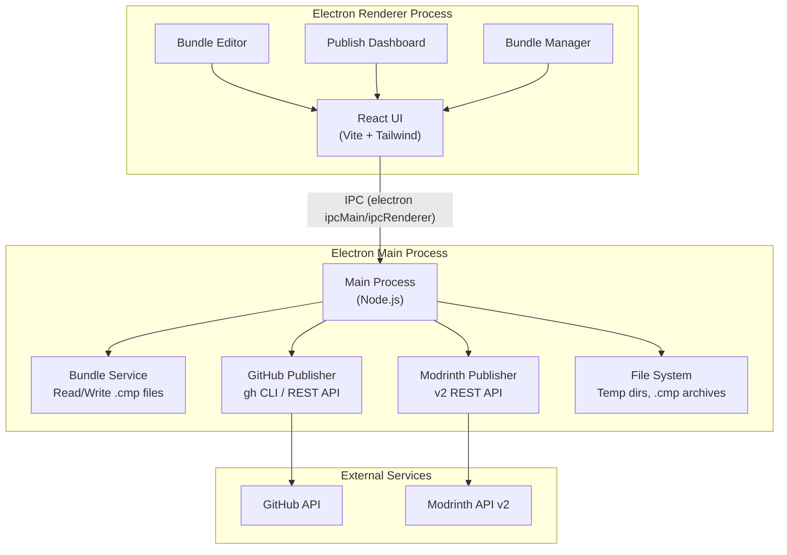
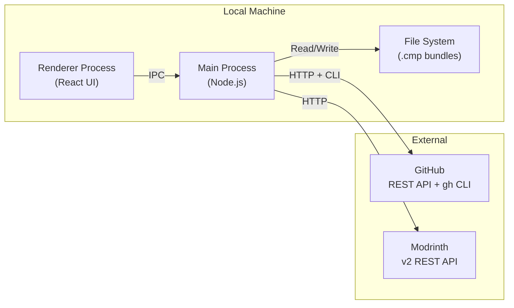
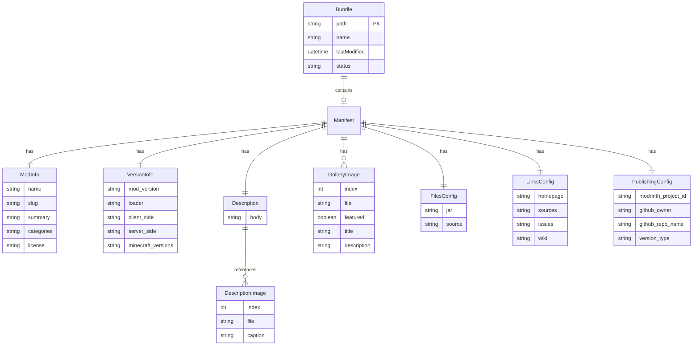

## 1. Architecture Design



## 2. Technology Description

- **Frontend**: React 18 + TailwindCSS 3 + Vite (bundled into Electron renderer)
- **Desktop Shell**: Electron 33+ (native macOS Apple Silicon build via electron-builder)
- **Build Tool**: Vite with electron-vite for main/renderer/preload separation
- **Backend**: None (all logic runs in Electron main process; external APIs called directly)
- **Database**: Local filesystem only — bundles stored as `.cmp` files; recent-bundles index in `~/Library/Application Support/CMP/bundles.json`
- **API Clients**: 
  - GitHub: `gh` CLI (pre-installed or bundled) + REST API via `fetch`
  - Modrinth: v2 REST API via `fetch` with multipart uploads
- **State Management**: Zustand (lightweight, no boilerplate)
- **Markdown Rendering**: react-markdown + remark-gfm for description preview
- **Code Highlighting**: shiki for manifest.json preview

## 3. Route Definitions

| Route | Purpose |
|-------|---------|
| `/` | Bundle Manager — list of saved bundles with quick actions |
| `/editor` | Bundle Editor — form-based editor for creating/editing a .cmp bundle |
| `/publish` | Publish Dashboard — GitHub + Modrinth publishing workflow with live log |

## 4. IPC API Definitions

The renderer communicates with the main process via Electron's IPC. All operations are async.

### 4.1 Bundle Operations

```typescript
// Open a file dialog to select or create a .cmp file
ipcInvoke("bundle:open"): { path: string; manifest: Manifest } | null

// Save current manifest + assets to a .cmp file
ipcInvoke("bundle:save", path: string, manifest: Manifest, assets: AssetMap): void

// Create a new empty bundle at a given path
ipcInvoke("bundle:create", path: string, name: string): { path: string; manifest: Manifest }

// Extract a .cmp to a temp dir for editing (returns asset file paths)
ipcInvoke("bundle:extract", path: string): { manifest: Manifest; assetPaths: Record<string, string> }

// Export a .cmp bundle (re-zip from current state)
ipcInvoke("bundle:export", path: string, manifest: Manifest, assets: AssetMap): void
```

### 4.2 Publish Operations

```typescript
// Step 1: Create GitHub repository
ipcInvoke("publish:github-create", config: {
  owner: string;
  repo: string;
  sourceDir: string;
  modName: string;
  modSummary: string;
}): { repoUrl: string; issuesUrl: string; wikiUrl: string }

// Step 2: Push source code to GitHub
ipcInvoke("publish:github-push", config: {
  owner: string;
  repo: string;
  sourceDir: string;
}): void

// Step 3: Create wiki + issue templates
ipcInvoke("publish:github-wiki", config: {
  owner: string;
  repo: string;
  modName: string;
}): { wikiUrl: string }

// Step 4: Create/resolve Modrinth project
ipcInvoke("publish:modrinth-create-project", config: {
  token: string;
  manifest: Manifest;
  iconPath: string;
}): { projectId: string; slug: string }

// Step 5: Upload version (jar) to Modrinth
ipcInvoke("publish:modrinth-upload-version", config: {
  token: string;
  projectId: string;
  manifest: Manifest;
  jarPath: string;
}): { versionId: string }

// Step 6: Upload gallery images to Modrinth
ipcInvoke("publish:modrinth-upload-gallery", config: {
  token: string;
  projectRef: string;
  gallery: Array<{ imagePath: string; featured: boolean; title: string; description: string }>;
}): void

// Step 7: Update Modrinth project with GitHub links and description
ipcInvoke("publish:modrinth-update-project", config: {
  token: string;
  projectRef: string;
  description: string;
  links: { sources: string; issues: string; wiki: string; homepage: string };
}): void
```

### 4.3 Utility Operations

```typescript
// Select a file via native dialog
ipcInvoke("dialog:open-file", options: { filters?: FileFilter[] }): string | null

// Select a directory via native dialog
ipcInvoke("dialog:open-directory"): string | null

// Read file as base64 (for image previews)
ipcInvoke("fs:read-base64", path: string): string

// Get recent bundles list
ipcInvoke("bundle:recent"): Array<{ path: string; name: string; lastModified: string }>
```

### 4.4 Type Definitions

```typescript
interface Manifest {
  cmp_version: 1;
  mod_info: ModInfo;
  version_info: VersionInfo;
  description: Description;
  icon: string;
  gallery: GalleryImage[];
  files: FilesConfig;
  links: LinksConfig;
  publishing: PublishingConfig;
}

interface ModInfo {
  name: string;
  slug: string;
  summary: string;
  categories: string[];       // Modrinth category slugs
  license: string;            // SPDX identifier
}

interface VersionInfo {
  mod_version: string;        // Semver
  loader: "fabric" | "forge" | "neoforge";
  client_side: "required" | "optional" | "unsupported";
  server_side: "required" | "optional" | "unsupported";
  minecraft_versions: string[];  // Exact versions e.g. ["1.20.1", "1.20.4"]
}

interface Description {
  body: string;               // Markdown with {{image:N}} placeholders
  images: DescriptionImage[];
}

interface DescriptionImage {
  index: number;
  file: string;               // Relative path in .cmp archive
  caption: string;
}

interface GalleryImage {
  index: number;
  file: string;
  featured: boolean;
  title: string;
  description: string;
}

interface FilesConfig {
  jar: string;                // Relative path to jar in .cmp archive
  source: string;             // Relative path to source dir in .cmp archive
}

interface LinksConfig {
  homepage: string;
  sources: string;
  issues: string;
  wiki: string;
}

interface PublishingConfig {
  modrinth_project_id: string;  // Empty = create new project
  github_owner: string;
  github_repo_name: string;
  version_type: "release" | "beta" | "alpha";
}

interface AssetMap {
  // Maps relative paths in the .cmp archive to absolute local file paths
  [relativePath: string]: string;
}
```

## 5. Server Architecture Diagram

No backend server. All logic runs locally in the Electron main process. External API calls are made directly from the main process using Node.js `fetch` and `child_process` (for `gh` CLI).



## 6. Data Model

### 6.1 Data Model Definition



### 6.2 Local Storage

No database. The app stores:

1. **Bundle files**: User-chosen locations on disk (`.cmp` zip archives)
2. **Recent bundles index**: `~/Library/Application Support/CMP/bundles.json` — a simple JSON array of `{ path, name, lastModified }` entries
3. **App preferences**: `~/Library/Application Support/CMP/preferences.json` — stores default GitHub owner, last-used Modrinth token name, window bounds, etc.
4. **Temp extraction**: `~/Library/Application Support/CMP/tmp/<session-id>/` — extracted .cmp contents for active editing sessions, cleaned up on app quit

## 7. Publishing Flow Detail

### 7.1 GitHub Repository Creation

1. Validate `gh` CLI is available and authenticated
2. Create public repository: `gh repo create <owner>/<repo> --public --description "<summary>"`
3. Push source code: copy source dir to temp clone, commit, push
4. Generate and push README.md with mod info
5. Enable Issues (default on public repos)
6. Create wiki with Home, Installation, Troubleshooting pages
7. Push issue templates under `.github/ISSUE_TEMPLATE/`
8. Return: `{ repoUrl, issuesUrl, wikiUrl }`

### 7.2 Modrinth Publishing

1. Read `MODRINTH_TOKEN` from environment or prompt user
2. If `modrinth_project_id` is empty:
   - Create draft project via `POST /v2/project` with multipart form (icon + metadata)
   - Store returned project ID back into manifest
3. Upload jar as version via `POST /v2/version` with multipart form
4. Upload gallery images via `POST /v2/project/<id>/gallery` for each image
5. Upload description images to Modrinth's image hosting, replace `{{image:N}}` placeholders with returned URLs
6. Patch project via `PATCH /v2/project/<id>` with final description body, GitHub links, and metadata

### 7.3 Error Handling

- Each publish step is atomic and logged
- If GitHub creation succeeds but Modrinth fails, the GitHub repo remains (user can retry Modrinth)
- If Modrinth project creation succeeds but version upload fails, the project ID is saved so the user can retry without creating a duplicate
- All API errors are caught and displayed in the publish log with actionable messages
