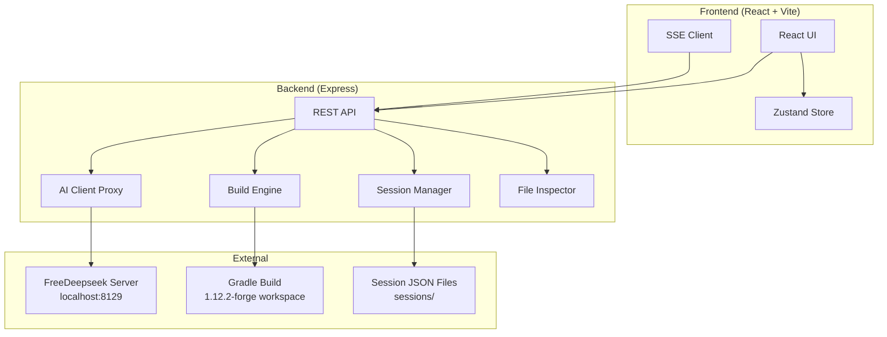

# Technical Architecture — Mod Wizard Web App

## 1. Architecture Design



## 2. Technology Description

- **Frontend**: React 18 + TypeScript + Vite + Tailwind CSS + Zustand
- **Backend**: Express 4 + TypeScript (ESM)
- **Communication**: REST API + Server-Sent Events (SSE) for streaming
- **Data Storage**: JSON files on disk (same `sessions/` directory as Python wizard)
- **Build Tool**: Vite with `react-ts` template
- **No database**: Session data stored as JSON files, compatible with Python wizard's session format

## 3. Route Definitions

| Route | Purpose |
|-------|---------|
| `/` | Dashboard — session list, server status, new/resume |
| `/wizard/:sessionId` | Active wizard flow for a specific session |
| `/wizard/:sessionId/files` | File inspector for the session's extracted files |
| `/wizard/:sessionId/build` | Build monitor with log streaming |

## 4. API Definitions

### 4.1 Server Status

```
GET /api/server/status
Response: { connected: boolean, hoster: string, models: string[] }
```

### 4.2 Session Management

```
GET    /api/sessions                    → Session[]
POST   /api/sessions                    → Session (created)
GET    /api/sessions/:id                → Session
DELETE /api/sessions/:id                → { ok: boolean }
PUT    /api/sessions/:id/checkpoint     → Session (updated)
GET    /api/sessions/:id/checkpoints    → Checkpoint[]
POST   /api/sessions/:id/resume/:step   → Session (resumed to step)
```

### 4.3 AI Chat

```
POST /api/chat
Body: { prompt: string, model: string, thinking: boolean, web_search: boolean,
        resume_url?: string, response_mode: string }
Response: SSE stream of { event: "content"|"done"|"error", content: string, chat_url?: string }
```

### 4.4 Build

```
POST /api/build
Body: { files: Record<string, string>, metadata: Record<string, string> }
Response: SSE stream of { event: "log"|"success"|"error", content: string }
```

### 4.5 Diagnosis

```
POST /api/diagnose
Body: { files: Record<string, string>, metadata: Record<string, string> }
Response: { issues: string[] }
```

### 4.6 File Inspector

```
GET /api/sessions/:id/files            → { files: Record<string, string>, metadata: Record<string, string> }
GET /api/workspace/files               → { files: string[] } (current workspace file listing)
GET /api/workspace/files/:path         → { content: string } (file content)
```

### 4.7 Response Parser

```
POST /api/parse
Body: { text: string }
Response: { files: Record<string, string>, metadata: Record<string, string>, summary: string }
```

## 5. Data Model

### 5.1 Session

```typescript
interface Session {
  id: string;
  current_step: StepId;
  mod_name: string | null;
  description: string | null;
  resume_url: string | null;
  response: string | null;
  result: { files: Record<string, string>; metadata: Record<string, string>; summary: string } | null;
  should_compile: boolean;
  compiled_ok: boolean;
  confirmed: boolean;
  created_at: string;
  updated_at: string;
  checkpoints: Checkpoint[];
}

type StepId = "start" | "step1_name" | "step2_desc" | "step3_sent" | "step5_diagnose" | "step6_compile" | "step7_refine" | "complete";

interface Checkpoint {
  step: StepId;
  label: string;
  timestamp: string;
  data: Record<string, unknown>;
}
```

### 5.2 Step Labels

```typescript
const STEP_LABELS: Record<StepId, string> = {
  start: "Not started",
  step1_name: "Name entered",
  step2_desc: "Description entered",
  step3_sent: "AI response received",
  step5_diagnose: "Diagnosis complete",
  step6_compile: "Compile attempted",
  step7_refine: "In refinement",
  complete: "Complete",
};
```

## 6. Backend Architecture

```
api/
  index.ts              Express app entry, middleware
  routes/
    server.ts           GET /api/server/status
    sessions.ts         CRUD for sessions + checkpoints
    chat.ts             POST /api/chat (SSE proxy to FreeDeepseek)
    build.ts            POST /api/build (SSE build streaming)
    diagnose.ts         POST /api/diagnose
    parse.ts            POST /api/parse
    files.ts            GET /api/sessions/:id/files, workspace files
  services/
    session-service.ts  JSON file read/write, checkpoint management
    ai-client.ts        HTTP client for localhost:8129, SSE forwarding
    build-engine.ts     Gradle build orchestration (clean, place, build, collect)
    diagnosis.ts        File structure analysis (ported from Python)
    response-parser.ts  AI response parsing (ported from Python)
    prompt-composer.ts  Prompt generation (ported from Python)
```

## 7. Frontend Architecture

```
src/
  pages/
    Dashboard.tsx       Session list, server status, new/resume
    Wizard.tsx          Step-based wizard flow
    FileInspector.tsx   File tree + code viewer
  components/
    StepTracker.tsx     Horizontal step progress indicator
    ServerStatus.tsx    Connection indicator
    SessionCard.tsx     Session list item
    CheckpointTimeline.tsx  Vertical timeline of checkpoints
    AiResponse.tsx      Streaming AI response display
    BuildLog.tsx        Build log with error highlighting
    CodeViewer.tsx      Syntax-highlighted code display
    FileTree.tsx        Collapsible file tree
    SummaryCard.tsx     AI summary display card
  hooks/
    useSession.ts       Session CRUD operations
    useChat.ts          AI chat with SSE streaming
    useBuild.ts         Build with SSE streaming
  store/
    wizard-store.ts     Zustand store for wizard state
```
