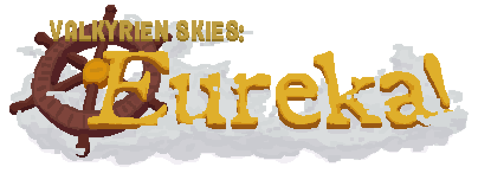

---

Eureka is a simple add-on for Valkyrien Skies that fits with vanilla aesthetic and is easy and fun to use.

Build and design your own ship out of ordinary (or modded!) Minecraft blocks, place a Ship Helm, shift + right-click, assemble, and watch your creation suddenly infuse with physics. No longer are your Minecraft builds bound to remain forever static, sitting in the same place for all eternity.

## Dependencies
> [!NOTE]
> Eureka comes with an integrated dependency downloader that will do all the hard work for you! Just download the Eureka JAR file and launch the game.

- [Valkyrien Skies](https://github.com/ValkyrienSkies/Valkyrien-Skies-2)
- [Architectury API](https://www.curseforge.com/minecraft/mc-mods/architectury-api)
- [Cloth Config API](https://www.curseforge.com/minecraft/mc-mods/cloth-config)
- [Kotlin For Forge](https://www.curseforge.com/minecraft/mc-mods/kotlin-for-forge) (Forge users only)
- [Fabric API](https://www.curseforge.com/minecraft/mc-mods/fabric-api) (Fabric users only)
- [Fabric Language Kotlin](https://www.curseforge.com/minecraft/mc-mods/fabric-language-kotlin) (Fabric users only)
- [Mod Menu](https://www.curseforge.com/minecraft/mc-mods/modmenu) (Fabric users only)
